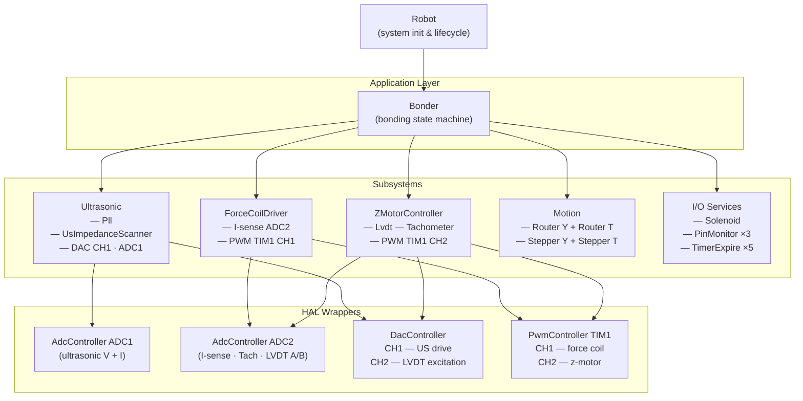

```mermaid
graph TD
    Robot["Robot\n(system init & lifecycle)"] --> Bonder

    subgraph application["Application Layer"]
        Bonder["Bonder\n(bonding state machine)"]
    end

    subgraph subsystems["Subsystems"]
        ZMC["ZMotorController\n— Lvdt  — Tachometer\n— PWM TIM1 CH2"]
        FCD["ForceCoilDriver\n— I-sense ADC2\n— PWM TIM1 CH1"]
        US["Ultrasonic\n— Pll\n— UsImpedanceScanner\n— DAC CH1 · ADC1"]
        MOT["Motion\n— Router Y + Router T\n— Stepper Y + Stepper T"]
        IO["I/O Services\n— Solenoid\n— PinMonitor ×3\n— TimerExpire ×5"]
    end

    subgraph hal["HAL Wrappers"]
        ADC1["AdcController ADC1\n(ultrasonic V + I)"]
        ADC2["AdcController ADC2\n(I-sense · Tach · LVDT A/B)"]
        DAC["DacController\nCH1 — US drive\nCH2 — LVDT excitation"]
        PWMC["PwmController TIM1\nCH1 — force coil\nCH2 — z-motor"]
    end

    Bonder --> ZMC & FCD & US & MOT & IO
    ZMC --> ADC2 & DAC & PWMC
    FCD --> ADC2 & PWMC
    US --> ADC1 & DAC
```